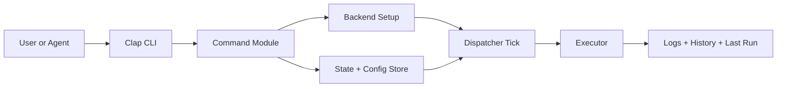
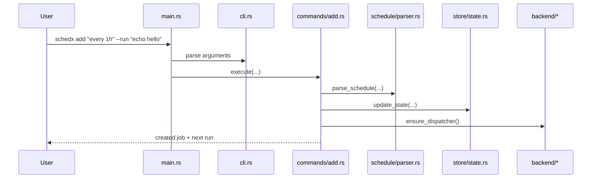
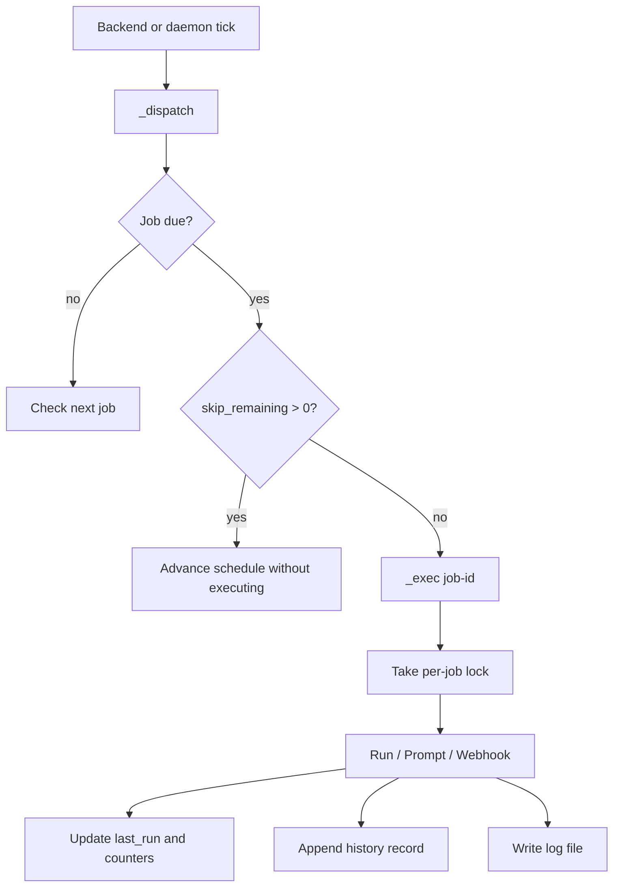

# schedx Onboarding Guide

This guide is for the first hour with the repository.

It answers four questions:

1. What is `schedx` trying to do?
2. How does a command move through the codebase?
3. Where does state live, and how does a scheduled run actually happen?
4. Where should you edit if you want to add a feature?

If you prefer a visual walkthrough, open [docs/presentation/index.html](presentation/index.html).

## 1. Mental Model

`schedx` is a scheduler CLI that stores job definitions locally and then triggers them later through one of three action types:

- `run`: execute a shell command or argv command
- `prompt`: invoke a named agent binary with prompt text
- `webhook`: make an HTTP request

At a high level, the repository is a loop around four concerns:

- parse user intent from CLI input
- store job definitions safely
- decide when jobs are due
- execute the chosen action and record what happened



## 2. Repository Map

The codebase is split by responsibility instead of by layer framework.

```text
src/
  main.rs               CLI entrypoint and exit-code mapping
  cli.rs                Clap command definitions
  commands/             User-facing command handlers
  engine/               Runtime behavior: dispatch, execute, locking, logging
  manifest/             Declarative schedx.yaml: parse, ${VAR} expand, plan, state
  model/                Serializable domain types
  schedule/             Schedule parsing and next-run computation
  store/                Filesystem persistence and atomic writes
  backend/              systemd / launchd / none scheduler integration
  output/               Human and JSON formatting
  util/                 IDs and redaction helpers

tests/
  cli_*.rs              End-to-end CLI behavior tests
  helpers/              Temporary SCHEDX_HOME test harness

docs/
  SPEC.md               Technical contract and design notes
  RELEASING.md          Release process
  ONBOARDING.md         This guide
  presentation/         HTML slide deck
```

## 3. Fast Path Through the Code

If you only read five files first, read these:

1. [`src/main.rs`](../src/main.rs)
2. [`src/cli.rs`](../src/cli.rs)
3. [`src/commands/add.rs`](../src/commands/add.rs)
4. [`src/engine/dispatcher.rs`](../src/engine/dispatcher.rs)
5. [`src/engine/executor.rs`](../src/engine/executor.rs)

That path takes you from:

- CLI parsing
- command dispatch
- job creation
- due-job detection
- job execution

## 4. End-to-End Command Flow

### `schedx add ...`

The `add` path is the cleanest way to understand the architecture.



The main entrypoint is intentionally thin:

```rust
let cli = Cli::parse();

let result = match &cli.command {
    Commands::Add { .. } => commands::add::execute(...),
    Commands::List { .. } => commands::list::execute(...),
    Commands::Run { id } => commands::run::execute(id),
    Commands::Dispatch => commands::dispatch::execute(),
    Commands::Exec { .. } => commands::exec::execute(...),
    // ...
};
```

What `commands/add.rs` does:

- validates action flags and limits
- builds a typed `Action`
- parses the schedule string into a `ParsedSchedule`
- creates a `Job`
- writes it under the state lock
- tries to ensure the system backend exists

The result is a new entry in `jobs.json` under `SCHEDX_HOME` or `~/.schedx`.

## 5. How Schedules Work

Schedules are parsed in [`src/schedule/parser.rs`](../src/schedule/parser.rs).

Accepted inputs:

- one-shot relative: `in 4h`
- one-shot bare duration: `30s`
- recurring interval: `every 10s`
- recurring cron: `0 9 * * 1-5`
- one-shot absolute timestamp: `2026-03-01T14:00:00Z`

The parser returns a `ParsedSchedule`, which is then turned into a serializable `JobSchedule`.

```rust
pub enum JobSchedule {
    RecurringCron { expr: String },
    RecurringInterval { every_seconds: u64 },
    OneShot { fire_at: DateTime<Utc> },
}
```

Important nuance:

- sub-minute recurrence uses `RecurringInterval`
- minute/hour/day recurrence usually becomes cron
- one-shot jobs become `Completed` after a non-internal run

## 6. Dispatch and Execution

There are two internal commands that make the scheduler work:

- `schedx _dispatch`
- `schedx _exec <job-id> --scheduled-for <ts> --trigger ...`

### Dispatch

`_dispatch` is the scheduler heartbeat. It is usually triggered by:

- `systemd` on Linux
- `launchd` on macOS
- `schedx daemon` in manual/foreground mode

`src/engine/dispatcher.rs`:

- takes a non-blocking dispatch lock
- loads current jobs
- computes whether each active job is due
- skips or spawns `_exec`
- cleans up old logs

### Execution

`_exec` runs a single job. `src/engine/executor.rs`:

- loads the job
- verifies the matching scheduled claim for scheduled runs
- takes a per-job non-blocking lock to prevent overlap
- creates a log file
- executes one of the three action types
- clears `in_flight` when the matching scheduled run finishes
- updates `last_run`, `run_count`, `last_scheduled_at`
- appends a `RunRecord` to history



## 7. Persistence Model

State is plain files in the scheduler home directory.

By default:

```text
~/.schedx/
  jobs.json
  config.json
  run-history.jsonl
  manifests/
  backups/
  logs/
  locks/
```

That directory layout is defined in [`src/store/paths.rs`](../src/store/paths.rs).

### Files

- `jobs.json`: authoritative job definitions and inline last-run summary
- `config.json`: agents, timeouts, backend settings
- `run-history.jsonl`: append-only run ledger
- `manifests/<name>.json`: what each declarative manifest (`schedx up`) last applied
- `logs/<job-id>/<run-id>.log`: raw run output
- `backups/*.json`: rotating state backups
- `locks/*.lock`: file locks for state, dispatch, and job overlap

### Persistence Guarantees

The persistence code is intentionally conservative:

- writes are atomic
- existing state is backed up before overwrite
- history is append-only
- directories and files use restrictive Unix permissions where supported

Read [`src/store/atomic.rs`](../src/store/atomic.rs), [`src/store/state.rs`](../src/store/state.rs), and [`src/store/history.rs`](../src/store/history.rs) together.

## 8. Action Types

`Action` lives in [`src/model/action.rs`](../src/model/action.rs).

### Run

- either shell mode (`/bin/sh -lc`) or split argv mode
- optional `workdir`
- stdout/stderr redirected to the run log

### Prompt

- uses a configured agent profile from `config.json`
- can pass the prompt as argv or stdin
- agent profiles are managed by `schedx agent ...`

### Webhook

- supports `GET`, `POST`, `PUT`, `PATCH`, `DELETE`
- blocks insecure `http://` by default
- limits request size and log size
- redacts sensitive fields in structured output

## 9. Backend Story

Backend selection happens in [`src/backend/mod.rs`](../src/backend/mod.rs).

Three modes exist:

- `systemd`
- `launchd`
- `none`

Selection rules:

- explicit `SCHEDX_BACKEND` wins
- otherwise Linux tries `systemd`
- macOS tries `launchd`
- fallback is an error suggesting `SCHEDX_BACKEND=none`

This is a useful design choice to remember:

- the scheduler logic is backend-agnostic
- backends only provide the tick
- actual due-job logic stays in Rust, not in system-specific unit files

## 10. Output and JSON Shape

Human-friendly output and machine-friendly output are separate concerns.

- commands use `println!` / `eprintln!` for human mode
- JSON mode uses the serializers in [`src/output/format.rs`](../src/output/format.rs)

That means:

- contributor changes to JSON output should happen in `output/`
- contributor changes to CLI text usually happen in `commands/`

This separation makes agent usage practical because the `--json` contract is stable and intentional.

## 11. Locks, Safety, and Operational Rules

There are three important locking paths:

- state lock: guards mutation of `jobs.json` and config-like state flows
- dispatch lock: ensures only one dispatcher tick runs at a time
- job lock: prevents overlapping runs of the same job

The job-execution path also isolates child processes into their own process group before enforcing timeouts. That matters because a timed-out command should not keep running after `schedx` marks it as done.

## 12. Tests: How Confidence Is Built

The tests are mostly CLI-first.

The harness in [`tests/helpers/mod.rs`](../tests/helpers/mod.rs):

- creates a fresh temp directory
- points `SCHEDX_HOME` there
- forces `SCHEDX_BACKEND=none`

That gives deterministic tests without relying on `systemd` or `launchd`.

Test files are task-oriented:

- `cli_add.rs`
- `cli_list.rs`
- `cli_run.rs`
- `cli_history.rs`
- `cli_lifecycle.rs`
- `cli_agent.rs`
- `schedule_parse.rs`

This is a strong repository habit to preserve: test public behavior first, not only private helpers.

## 13. The Most Important Design Choices

If you contribute here, keep these decisions in mind:

- local files are the source of truth
- scheduler ticks are external, but scheduling decisions stay in Rust
- raw command output goes to logs, not to state
- `last_run` is a summary, history is the durable audit trail
- JSON mode is a public interface
- the CLI is optimized for agents as much as humans

## 14. Where to Edit for Common Changes

### Add a new top-level command

- add the command shape in [`src/cli.rs`](../src/cli.rs)
- route it in [`src/main.rs`](../src/main.rs)
- implement it in `src/commands/<name>.rs`

### Add a new action type

- extend [`src/model/action.rs`](../src/model/action.rs)
- update action construction in [`src/commands/add.rs`](../src/commands/add.rs)
- update execution in [`src/engine/executor.rs`](../src/engine/executor.rs)
- update JSON formatting in [`src/output/format.rs`](../src/output/format.rs)
- add tests

### Change schedule parsing

- edit [`src/schedule/parser.rs`](../src/schedule/parser.rs)
- update tests in [`tests/schedule_parse.rs`](../tests/schedule_parse.rs)
- check that `compute_next_run` still matches skip handling and any `in_flight` claim behavior

### Change persistence layout

- start with [`src/store/paths.rs`](../src/store/paths.rs)
- then inspect `state.rs`, `history.rs`, `backup.rs`, `atomic.rs`
- think about migration and backward compatibility before changing schemas

### Change declarative manifest behavior (schedx.yaml)

- the pipeline is `parse → expand → plan → apply`:
  [`src/manifest/parse.rs`](../src/manifest/parse.rs) (yaml shape;
  unknown keys are rejected), [`src/manifest/env.rs`](../src/manifest/env.rs)
  (`${VAR}` expansion), [`src/manifest/plan.rs`](../src/manifest/plan.rs)
  (the PURE reconcile — the create/update/prune/drift table lives here, with
  a unit test per row)
- [`src/manifest/state.rs`](../src/manifest/state.rs) records what a manifest
  applied (`~/.schedx/manifests/<name>.json`) and recovers ownership from job
  markers when the state file is lost
- [`src/commands/up.rs`](../src/commands/up.rs) and
  [`src/commands/down.rs`](../src/commands/down.rs) stay thin: lock first,
  then read + plan + apply in one atomic state write
- schedule validation happens at PLAN time, not parse time, so every problem
  reports together and any error means nothing is applied
- tests: [`tests/cli_up.rs`](../tests/cli_up.rs) and
  [`tests/cli_down.rs`](../tests/cli_down.rs) — CLI-first like everything else

## 15. Suggested Reading Order for Contributors

If you have 15 minutes:

1. `README.md`
2. `src/main.rs`
3. `src/cli.rs`
4. `src/commands/add.rs`
5. `src/engine/dispatcher.rs`
6. `src/engine/executor.rs`

If you have 45 minutes:

1. everything above
2. `src/store/*`
3. `src/model/*`
4. `src/schedule/parser.rs`
5. `src/manifest/plan.rs` (the declarative reconcile — pure and heavily unit-tested)
6. `tests/*`

If you plan to change runtime behavior:

1. `src/backend/*`
2. `src/engine/*`
3. `src/store/*`
4. `docs/SPEC.md`

## 16. Practical First Tasks

Good first repository tours:

- run `cargo test --locked`
- create a local job with `schedx add "every 10s" --run "echo hello"`
- inspect the resulting files under `SCHEDX_HOME`
- run `schedx list --json`
- trigger `schedx run <job-id>`
- inspect logs and history

That single exercise teaches most of the system.

## 17. Final Summary

The shortest true summary of the repository is:

> `schedx` is a local-first scheduling engine with a CLI front door, file-backed state, a backend-provided heartbeat, and a single execution engine for commands, prompts, and webhooks.

Once that clicks, the rest of the repository is much easier to navigate.
